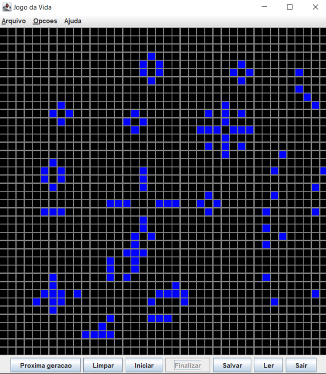

# 🧬 Conway’s Game of Life — Java Implementation

<p align="center">
  
</p>

This is a fully functional, GUI-based implementation of **Conway’s Game of Life**, built in **Java** using AWT/Swing.  
It simulates cellular automata evolution based on simple rules and allows user interaction via a graphical interface.

---

## 🧠 What is the Game of Life?

Conway's Game of Life is a **zero-player game** in which cells on a grid evolve across generations according to fixed rules:

1. A live cell with 2 or 3 neighbors survives  
2. A dead cell with exactly 3 live neighbors becomes alive  
3. All other cells die or remain dead

These simple rules give rise to surprisingly complex patterns.

---

## ✨ Features

- GUI-based visualization of the grid using Java Swing  
- Manual and automatic generation control (start/pause/next)  
- Save and load pattern files  
- Real-time simulation updates  
- Cell editing by clicking

---

## 📁 Project Files

| File/Class                | Description                                 |
|---------------------------|---------------------------------------------|
| `App.java`                | Program entry point                         |
| `Life.java`               | Core logic: grid, rules, cell behavior      |
| `LifeGraf.java`           | GUI visualization with painting logic       |
| `LifeText.java`           | Text-mode fallback (terminal)               |
| `RunLifeGraf.java`        | Starts GUI mode                             |
| `RunLifeText.java`        | Starts text-based version                   |
| `Celula.java`             | Cell abstraction                            |
| `DadosIncorretosException.java` | Custom error handling for inputs     |
| `Teclado.jar`             | External JAR for input support              |
| `*.ctxt` and `.class`     | Compiled artifacts and BlueJ files          |

---

## 🖥 How to Run

### ✅ Using BlueJ

1. Open the project in BlueJ  
2. Right-click `RunLifeGraf` → "void main(String[] args)" → Run  
3. Use buttons to control the simulation

### 💻 Using terminal

```bash
javac *.java
java RunLifeGraf
```

---

## 🗂 Example Controls

- **Start / Pause**: Begins or stops continuous simulation  
- **Next Generation**: Applies one evolution step  
- **Clear**: Empties the board  
- **Save / Load**: Store patterns to file

---

## 👨‍💻 Author

Developed by [Leonardo Grupioni](https://github.com/leonardogrupioni)  

---

## 📄 License

Open for educational and personal use only.
